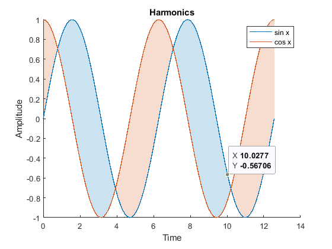

# Fill Between Area Curve

[](https://www.mathworks.com/matlabcentral/fileexchange/133622-fill-between-area-curve) [](https://matlab.mathworks.com/open/github/v1?repo=MATLAB-Graphics-and-App-Building/fill-between-area-curve&file=Example.mlx)

Version 1.0



## Description 
The Fill Between Area Curve creates a shaded area between two data series, effectively highlighting the region of overlap or difference.

## Dependencies
For optimal performance and accurate graphs, please install the <b> Mapping Toolbox </b>. 

## Syntax
* `fillBetweenAreaCurve(x, y1, y2)` shades the area between 2 lines formed by y1 and y2
* `fillBetweenAreaCurve(x, y1, y2, c)` shades the area between 2 lines formed by y1 and y2 with color c.
* `fillBetweenAreaCurve(__, Name, Value)` specifies additional options for the FillBetweenAreaCurve using one or more name-value pair arguments. Specify the options after all other input arguments.

## Name-Value Pair Arguments/Properties

* `XData` Array containing values of x-coordinates for both plots y1 and y2. <b> Note: x-coordinates for both y1 and y2 should be common </b>
* `Y1Data` y-coordinates of y1 plot
* `Y2Data` y-coordinates of y2 plot
* `Condition` The condition property selectively shades the area based on the condition provided by the user. 
* `ShadeInverse` Shades all the unshaded regions between 2 curves with a different color. 
* `OptimizePerformance` Calculate the vertices of triangles that compose the patch manually instead of asking patch to do it
## Stylistic Name-Value Pair Arguments/Properties

* `FaceAlpha` Describes opacity of shaded area. If set to 1, the shaded area is completely opaque. If set to 0, the shaded area is completely transparent. 
* `FaceColor` Describes the color of shaded area specified by Condition
* `InverseFaceColor` If ShadeInverse is set to true, we shade the unshaded region with InverseFaceColor
* `Line1Color` Line color for plot describing y1 values
* `Line2Color` Line color for plot describing y2 values
* `XLabel` Label for x axis
* `YLabel` Label for y axis
* `Line1LineStyle` Line Spec for plot describing y1 values
* `Line2LineStyle` Line Spec for plot describing y2 values
* `Line1LineWidth` Line Width for plot describing y1 values
* `Line2LineWidth` Line Width for plot describing y2 values 
* `Label1` Label for plot describing y1 values
* `Label2` Label for plot describing y2 values
* `Title` Title of the chart


### How to use

```matlab
% Intialize some data 
x = linspace(0, 4 * pi, 20);
y_sinx = sin(x);
y_cosx = cos(x);

% Create a basic FillBetweenAreaCurve
areaCurve = fillBetweenAreaCurve(x, y_sinx, y_cosx);

% Create a basic FillBetweenAreaCurve with magneta shading
areaCurveMagneta = fillBetweenAreaCurve(x, y_sinx, y_cosx, 'm');


% Create a FillBetweenAreaCurve with selective shading
areaCurveSelectiveShading = fillBetweenAreaCurve(x, y_sinx, y_cosx, 'Condition',   @(x, y1, y2) x > 2 & x < 4);
areaCurveCondition2.ShadeInverse = false;

```
